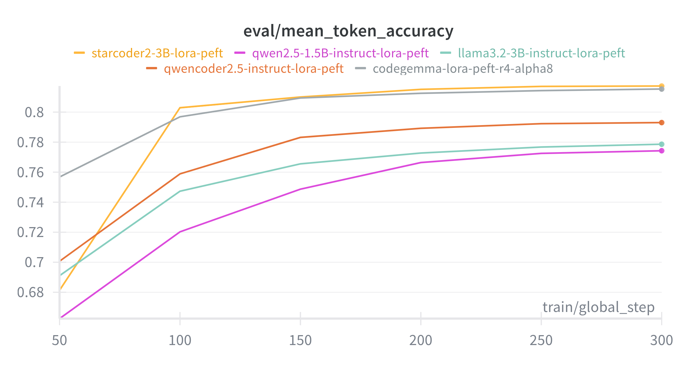
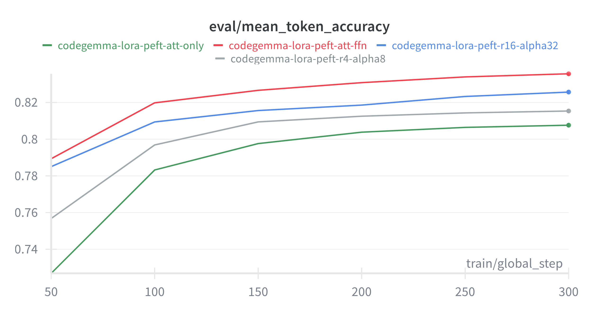

<div align="center">

# 🚀 AutoDoc Course

[](LICENSE)
[](https://www.python.org/downloads/)
[](#-course-lessons)

**Learn how to fine-tune language models to automatically generate high-quality docstrings across multiple programming languages.**

</div>


<!-- [](#-cost-breakdown) -->

## 🎯 What You'll Learn

- **Multi-task Fine-tuning**: Train models to generate docstrings across multiple programming languages simultaneously
- **LLM Fine-tuning Techniques**: Instruction fine-tuning and RL fine-tuning using GRPO
- **Hands-on Experience**: Work with different fine-tuning libraries (PEFT, TRL, Unsloth)
- **Cloud Infrastructure**: Deploy scalable training with Modal
- **Performance Evaluation**: Compare models using automated metrics and evaluation frameworks

## 🚀 Quick Start

```bash
# Clone and install
git clone https://github.com/fastbatchai/docstring-generation.git
cd docstring-generation
uv pip install -e .

# Setup Modal
modal setup

# Run training
modal run -i -m autoDoc.train --training-type sft --use-unsloth
```

## 📖 Course Lessons

- **[Lesson 1: Introduction to LLM Fine-tuning](lessons/lesson-1-introduction.md)** - Fine-tuning fundamentals
- **[Lesson 2: Data Preparation](lessons/lesson-2-data-preparation.md)** - Multi-language dataset preprocessing and prompt engineering
- **[Lesson 3: Instruction Fine-tuning](lessons/lesson-3-sft.md)** - SFT implementation with Alpaca format, Modal infrastructure, and monitoring
- **[Lesson 4: RL Fine-tuning](lessons/lesson-4-grpo.md)** - GRPO implementation, reward functions, and preference learning
- **[Lesson 5: Evaluation and Comparison](lessons/lesson-5-evaluation.md)** - Automated metrics and model comparison *(Coming Soon)*

## 📊 Results

### Fine-tuning Performance: CodeGemma vs CodeGemma+LoRA

<div align="center">

| Language | CodeGemma | CodeGemma+LoRA | Improvement |
|:--------:|:---------------------:|:--------------:|:-----------:|
| Python   | 0.47                 | 0.52           | +11%        |
| Java     | 0.57                 | 0.55           | -4%         |
| JavaScript | 0.43                 | 0.48           | +12%        |
| Go       | 0.49                 | 0.54           | +10%        |
| PHP      | 0.42                 | 0.63           | +50%        |
| Ruby     | 0.52                 | 0.60           | +15%        |

</div>

> **NOTE:** These are preliminary results based on training with a small subset (1K samples for each programming language).

### Instruction finetuning results

<div align="center">

<table>
<tr>
<td align="center">
<b>Model Comparison Across Different Base Models</b><br/>

</td>
<td align="center">
<b>LoRA Configuration Impact on Performance</b><br/>

</td>
</tr>
</table>

</div>

More results are available in **[Lesson 5: Evaluation and Comparison](lessons/lesson-5-evaluation.md)**

## 🤝 Community

- **Discussions**: [GitHub Discussions](https://github.com/fastbatchai/docstring-generation/discussions)
- **Issues**: [Report bugs](https://github.com/fastbatchai/docstring-generation/issues)
- **Newsletter**: [Subscribe for updates](https://substack.com/@fastbatch)

## 📄 License

MIT License - see [LICENSE](LICENSE) file for details.

---

**⭐ Star this repository if you found it helpful!**
