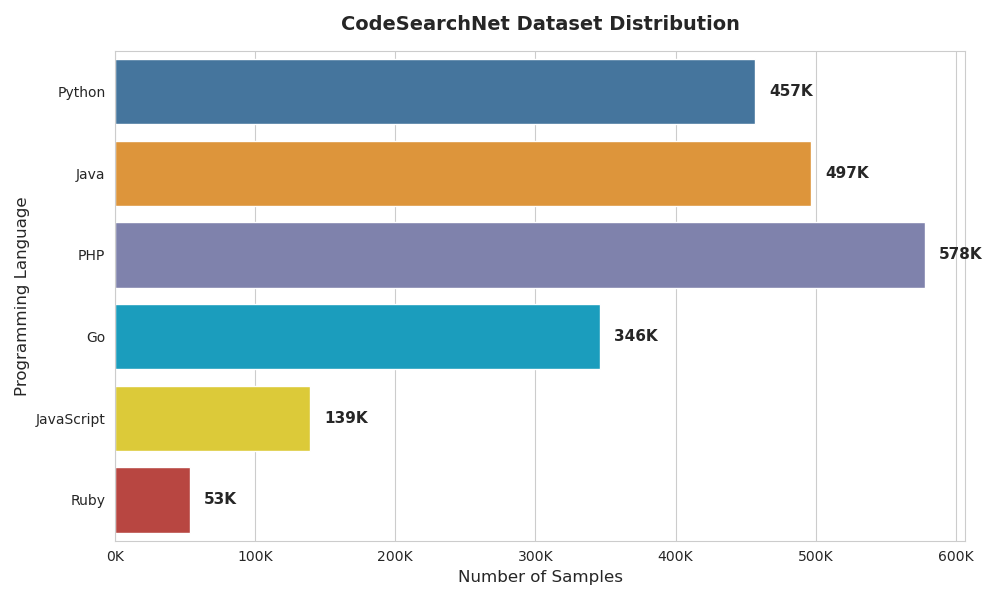

# Lesson 2: Data Preparation for LLM finetuning

*Welcome to the AutoDoc course! In this lesson, we'll dive deep into preparing high-quality training data for fine-tuning language models to generate docstrings automatically.*

## 🎯 What You'll Learn

By the end of this lesson, you'll understand:
- How to preprocess and clean data to ensure high-quality
- How to prepare data for supervised and RL finetuning
- How to handle multiple programming languages in a unified training pipeline

## Data for instruction finetuning
As discussed in the previous lesson, instruction finetuning involves adapting a language model on a collection of instruction-formatted instances. These instances consist of:
- **Task description** (the instruction)
- **Optional input** (parameters for the instruction)
- **Desired output** (the expected response)
- **Optional demonstrations** (few-shot examples)

It is common to construct instruction instances by reformatting traditional NLP tasks datasets (e.g., text summarization, Q&A) into the tempate above.

In this project,we follow this approach using the [CodeSearchNet](https://huggingface.co/datasets/claudios/code_search_net) dataset. `CodeSearchNet` contains 2 million (code, documentation) pairs for several programming languages (Python, GO, Java, Javascript, PHP, Ruby). This dataset is designed for `language modeling` tasks to build language models to write code.

Here is an example of an instance:
```python
{
  'id': '0',
  'repository_name': 'organisation/repository',
  'func_path_in_repository': 'src/path/to/file.py',
  'func_name': 'func',
  'whole_func_string': 'def func(args):\n"""Docstring"""\n [...]',
  'language': 'python',
  'func_code_string': '[...]',
  'func_code_tokens': ['def', 'func', '(', 'args', ')', ...],
  'func_documentation_string': 'Docstring',
  'func_documentation_string_tokens': ['Docstring'],
  'split_name': 'train',
  'func_code_url': 'https://github.com/<org>/<repo>/blob/<hash>/src/path/to/file.py#L111-L150'
}
```


### 🔧 Data Preprocessing
Different preprocessing steps have been already applied to the original dataset. For example, functions without documentation are removed from the corpus and shorter docstrings than three tokens are also removed.

However, I noticed that, for some programming languages especially Python, the docstring appears inside the code itself, which leads to *data leakage*. To prevent this,we must remove the embedded docstring from the code before training.

Here’s a simple preprocessing function that handles various languages:
```python
def remove_first_docstring(code_str: str) -> str:
    """Remove first block comment or string literal inside a function.

    Handles Python triple quotes, Java/Go/JS/PHP block comments, and leading // lines.
    """
    # Python triple quotes (""" or ''')
    code_str = re.sub(r'("""|\'\'\')(.*?)\1', "", code_str, count=1, flags=re.DOTALL)

    # /** */ or /* */ comments (Java, JavaScript, Go, PHP)
    code_str = re.sub(r"/\*\*(.*?)\*/", "", code_str, count=1, flags=re.DOTALL)
    code_str = re.sub(r"/\*(.*?)\*/", "", code_str, count=1, flags=re.DOTALL)

    # single-line // comments at the start
    code_str = re.sub(r"^\s*//.*?$", "", code_str, count=1, flags=re.MULTILINE)

    return code_str.strip()
```
### Instruction formatting
Now, we can use the (code, documentation) pairs to construct instruction instances for training. The input and desired output are given by `func_code_string` and `func_documentation_string`. Now, we need to write a task description for the different instances.

Because our dataset covers multiple programming languages, we treat each language as a separate task. To help the model differentiate them, we include the language name in the task description.
In this project, the task description `Generate a docstring for this {language} code` is used where the `language` placeholder is replaced by the corresponding programming language.

Finally, we will use the famous [ALPACA](https://crfm.stanford.edu/2023/03/13/alpaca.html) format to prepare the training instances.
```python
ALPACA_PROMPT = """Below is an instruction that describes a task, paired with an input that provides further context. Write a response that appropriately completes the request.

### Instruction:
Generate a docstring for this {} code

### Input:
{}

### Response:
{}"""
```

This is the final instruction instance
```bash
Below is an instruction that describes a task, paired with an input that provides further context. Write a response that appropriately completes the request.

### Instruction:
Generate a docstring for this python code

### Input:
def addidsuffix(self, idsuffix, recursive=True):
    if self.id:
        self.id += idsuffix
    if recursive:
        for e in self:
            try:
                e.addidsuffix(idsuffix, recursive)
            except Exception:
                pass

### Response:
Appends a suffix to this element's ID, and optionally to all child IDs as well. There is usually no need to call this directly, invoked implicitly by :meth:`copy`
<|endoftext|>
```

> Note: `<|endoftext|>` is the end-of-sequence (EOS) token used by the CodeGemma model.
Including this token is important to signal the model when to stop generating. Always check your base model’s tokenizer to find its EOS token.

> You might be wondering why we have the response in the training instance. This is a valid concern. In instruction finetuning, it is common to mask the input tokens and only the output tokens are considered for the loss computation. However, this is not automatically done in HuggingFace library where the model is trained on the [shifted](https://huggingface.co/docs/trl/en/sft_trainer#label-shifting-and-masking) inputs (one-token shift) to predict the next token.

Here's how we put everything together:
```python
def load_and_preprocess_dataset(config, lang, seed):
    from datasets import load_dataset

    print(
        f"Downloading dataset: {config.dataset_name}, language: {lang}-{config.max_samples}"
    )

    ds = load_dataset(config.dataset_name, lang, split=f"train[:{config.max_samples}]")
    ds = ds.map(
        lambda x: {"code": du.remove_first_docstring(x["func_code_string"])},
        batched=False,
    )
    ds = ds.rename_column("func_documentation_string", "docstring")

    ds = ds.train_test_split(test_size=1.0 - config.train_split_ratio, seed=seed)

    fn_kwargs = {}
    if config.training_type == "sft":
        fn_kwargs = {"eos_token": config.eos_token}

    train_dataset = ds["train"].map(
        config.preproc_func,
        batched=False,
        fn_kwargs=fn_kwargs,
    )
    eval_dataset = ds["test"].map(
        config.preproc_func, batched=False, fn_kwargs=fn_kwargs
    )
    return train_dataset, eval_dataset
```
`preproc_func` is the function that will format the dataset instances in the ALPACA format (Check `format_alpaca_example` [data_utils.py](../autoDoc/dataset_utils.py)).

### Multi-task dataset
Since the dataset includes a mixture of tasks (e.g., programming languages), it is important to balance the proportion of samples from each task (check data distribution below). As we saw in the previous [lesson](./lesson-1-introduction.md), there are different ways of data mixture.
<div align="center">



</div>

In this project, I implemented:
- **Maximum cap**: Limits the maximum number of examples per task to prevent larger task from overwhelming the distribution. The maximum cap is a parameter that can be changed in the [config](../autoDoc/config.py). Also setting a maximum cap is helpful to speed the training (more samples, more training time);
- **Examples-proportional mixing**: All tasks are combined and instances are sampled uniformly.
```python
def prepare_dataset(config: dataclass, load_or_cache_dataset: Callable):
    print(f"Downloading and processing datasets: {config.dataset.dataset_name}")
    langs = ["python", "java", "javascript", "php", "ruby", "go"]

    train_datasets = []
    eval_datasets = []
    for lang in langs:
        train_ds, eval_ds = load_or_cache_dataset(
            config.dataset, lang, seed=config.seed
        )

        train_datasets.append(train_ds)
        eval_datasets.append(eval_ds)

    # Merge all into one dataset
    train_dataset = concatenate_datasets(train_datasets)
    eval_dataset = concatenate_datasets(eval_datasets)

    return train_dataset, eval_dataset
```

### Dataset Caching
To avoid redownloading and processing the dataset everytime we ran the finetuning, we can cache the dataset using Modal [Volumes](https://modal.com/docs/guide/volumes).

First, we need to create the volume as follows:
```python
dataset_cache_volume = modal.Volume.from_name("finetune-dataset-cache", create_if_missing=True)
```
After the first run, the dataset is stored locally and reloaded from the cache in subsequent executions. You can check out the implementation [train.py](../autoDoc/train.py).

## Data for RL-finetuning
For RL-based fine-tuning (e.g., GRPO or PPO), the data pipeline remains mostly the same except for the prompt format.
Here, we no longer include the expected output, since the model’s goal is to maximize reward rather than predicting the next token. Here is the prompt format for RL finetuning:
```python
"""You are an expert software engineer who writes clear, comprehensive docstrings for code functions.

Task: Generate a docstring for the following {language} function.

Code:
{code}

Docstring:"""
```

## Test the data pipeline
To test the output of the data pipeline above, check the tests in [test_dataset.py](../tests/test_dataset.py).
```bash
pytest tests/test_dataset.py
```


---


*Ready to dive deeper? You can explore the full implementation in the [AutoDoc repository](https://github.com/fastbatchai/docstring-generation)*


## 🚀 What's Next?

Now that we have finished the data preparation, we are ready to start fine-tuning!

- **Lesson 3**: Building instruction fine-tuning pipelines with Modal
- **Lesson 4**: Implementing GRPO for RL finetuning
- **Lesson 5**: Comprehensive evaluation and model comparison
