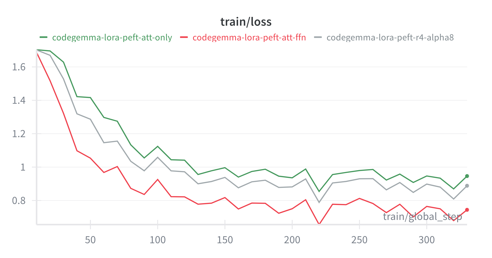

# Lesson 3: Finetune a language model for less than 1$

*Welcome back to the AutoDoc course! In this lesson, we'll implement supervised fine-tuning (SFT) from scratch using QLoRA and Modal infrastructure.*

## 🎯 What You'll Learn

By the end of this lesson, you'll understand:
- How to implement instruction fine-tuning using the TRL library
- How to integrate LoRA and QLoRA using the PEFT library
- How to accelerate the training using Unsloth
- How to launch training on Modal infrastructure

## Background Recap

As detailed in [lesson 1](./lesson-1-introduction.md), instruction finetuning is a supervised learning technique that teaches a pre-trained language model how to follow specific instructions and generate appropriate responses.

Traditional SFT usually involves updating all the model parameters. However, this can be time-consuming and computationally expensive. This is why parameter-efficient finetuning (PEFT) is more common. Particularly, **LoRA** (low-rank adaptation) reduces the training cost by introducing small trainable matrices that represent only a fraction of the model's weights. **QLoRA** is a variant where the base model is loaded in 4-bit precision, which further reduces memory usage. If you are unfamiliar with these concepts, please check [lesson 1](./lesson-1-introduction.md) for a conceptual overview of LLM post-training methods.

## Finetune a language model with LoRA

[PEFT](https://huggingface.co/docs/peft/index) and [TRL](https://huggingface.co/docs/trl/en/index) are well-known libraries for fine-tuning LLMs by Hugging Face. We will mainly use these two libraries in this tutorial. We will also use other libraries like [Unsloth](https://unsloth.ai/) to further speed up the training and lower the memory usage (VRAM).

### Data Preparation

Please check the [previous lesson](./lesson-2-data-preparation.md) where I detailed the data preparation pipeline.

### Model Configuration
First, we need to load our base model. This is the model we are finetuning. This can be done using the `transformers` library:

```python
from transformers import AutoModelForCausalLM, AutoTokenizer
import os

model = AutoModelForCausalLM.from_pretrained(
    config.model_name,
    load_in_4bit=config.load_in_4bit,
    load_in_8bit=config.load_in_8bit,
    device_map="auto",
    token=os.environ["HF_TOKEN"],
)
tokenizer = AutoTokenizer.from_pretrained(config.model_name)
tokenizer.pad_token = tokenizer.eos_token
```
or the `Unsloth` library:

```python
import unsloth

model, tokenizer = unsloth.FastLanguageModel.from_pretrained(
    model_name=config.model_name,
    max_seq_length=config.max_length,
    dtype=None,
    load_in_4bit=config.load_in_4bit,
    load_in_8bit=config.load_in_8bit,
)
```
> `load_in_4bit=True` activates QLoRA.

>The `FastLanguageModel` is a wrapper around the `transformers` library that implements optimizations to improve speed and reduce memory of different LLM operations.


Next, we will configure the LoRA adapters and integrate it with the base model.

```python
from peft import LoraConfig, get_peft_model, prepare_model_for_kbit_training

# 1- define the LoRA configuration
lora_config = LoraConfig(
    r=config.lora_r,
    lora_alpha=config.lora_alpha,
    target_modules=config.lora_target_modules,
    lora_dropout=config.lora_dropout,
    bias=config.lora_bias,
    task_type="CAUSAL_LM",
)
# 2- create the PEFT model
if config.load_in_4bit or config.load_in_8bit:
    model = prepare_model_for_kbit_training(model, use_gradient_checkpointing=False)

model = get_peft_model(model, lora_config)
```

As a reminder, let's see how LoRA is implemented. LoRA introduces two trainable matrices $A$ and $B$ where $A \in \mathbb{R}^{d\times r}$ and $B \in \mathbb{R}^{r\times k}$ where $d$ and $k$ are the model weight dimensions.
<div align="center">

$h = W_0x + BAx$

</div>

In the original paper, $BA$ is scaled by $\frac{\alpha}{r}$. LoRA dropout was introduced in the [QLoRA](https://arxiv.org/pdf/2305.14314) paper where the authors showed that a dropout of $0.05$ is useful for small models. The pseudocode below showcases how LoRA is implemented (based on [PEFT implementation](https://github.com/huggingface/peft/blob/v0.17.0/src/peft/tuners/lora/layer.py#L771)).

```python
import torch.nn as nn

class LoRALayer(nn.Module):
    def __init__(self, in_features, out_features, config):
        super().__init__()
        self.A = nn.Linear(in_features, config.lora_rank, bias=False)
        self.B = nn.Linear(rank, out_features, bias=config.lora_bias)
        self.scaling = config.lora_alpha / config.lora_rank
        self.dropout = nn.Dropout(config.lora_dropout)

    def forward(self, x):
        return self.scaling * self.B(self.A(self.dropout(x)))
```

")
</div>

> Another important parameter in LoRA configuration is the `target_modules`, the weights to which the low-rank decomposition is applied. In the original paper, LoRA is applied to the attention projection weights (see figure above for an illustration).

### Trainer
We will use the `SFTTrainer` to fine-tune the LoRA matrices. To do so, we need to set up the trainer configuration and feed it to the trainer along with the model and tokenizer.

```python
from trl import SFTConfig, SFTTrainer

training_args = SFTConfig(
    output_dir=str(checkpoint_path),
    num_train_epochs=config.num_train_epochs,
    per_device_train_batch_size=config.batch_size,
    gradient_accumulation_steps=config.gradient_accumulation_steps,
    learning_rate=config.learning_rate,
    lr_scheduler_type=config.lr_scheduler_type,
    warmup_steps=config.warmup_steps,
    logging_steps=config.logging_steps,
    max_length=config.max_length,
    seed=config.seed,
    eval_steps=config.eval_steps,
    save_steps=config.save_steps,
    eval_strategy="steps" if not config.skip_eval else "no",
    save_strategy="steps",
    dataset_text_field="text",
    report_to="wandb",
    bf16=config.bf16,
    save_total_limit=config.save_total_limit,
)

trainer = SFTTrainer(
    model=model,
    train_dataset=train_dataset,
    eval_dataset=eval_dataset,
    processing_class=tokenizer,
    args=training_args,
)
trainer.train()
```
I won't detail all the parameters in the `SFTConfig` (check [documentation](https://huggingface.co/docs/trl/v0.24.0/en/sft_trainer#trl.SFTConfig) for more details). However, I will comment on the parameters that impact the training:
- `dataset_text_field`: This is a crucial parameter that specifies to the trainer where to find the training prompts
- `bf16`: When set to True, the model (e.g., the LoRA matrices) is fine-tuned in mixed-precision
- `gradient_accumulation_steps`: Along with `per_device_train_batch_size`, this determines the effective batch size used to fine-tune the model
- `report_to`: Integrates the trainer with Weights and Biases for experiment tracking

Check [train.py](../autoDoc/train.py) to see the full implementation.

## Training Infrastructure using Modal

Modal provides a powerful serverless platform for running ML workloads. To launch the training on Modal, we need to set up the training infrastructure:

### Container Image Configuration

Modal Image is the environment in which Modal code runs. To define an Image, it is typical to start from a base Image like a Debian Linux container and then chain different methods to customize the image. For example, the `uv_pip_install` method is used to install the needed dependencies in the environment using the `uv` package. The `env` command adds environment variables. For more information, check the official [documentation](https://modal.com/docs/guide/images).

```python
import modal
base_image: modal.Image = (
    modal.Image.debian_slim()
    .uv_pip_install(
        "accelerate==1.9.0",
        "datasets==3.6.0",
        "hf-transfer==0.1.9",
        "huggingface_hub==0.34.2",
        "peft==0.16.0",
        "trl==0.19.1",
        "transformers==4.54.0",
        "wandb==0.21.0",
        "unsloth[cu128-torch270]==2025.7.8",
        "unsloth_zoo==2025.7.10",
        "bitsandbytes",
        "bert-score",
        "ipython",
    )
    .env({"HF_HOME": "/model_cache"})
    .add_local_python_source("autoDoc")
)
```

### Volume Configuration

Modal volumes provide persistent storage across function invocations. I define three volumes for models, datasets, and checkpoints:

```python
# Persistent volumes for caching
model_cache_volume = modal.Volume.from_name("finetune-model-cache", create_if_missing=True)
dataset_cache_volume = modal.Volume.from_name("finetune-dataset-cache", create_if_missing=True)
checkpoint_volume = modal.Volume.from_name("finetune-checkpoints", create_if_missing=True)
```

### Modal App Configuration

Finally, we need to define a Modal [`App`](https://modal.com/docs/guide/apps) that groups all the different functions needed for the training:
```python
train_app = modal.App(
    "docstring-finetune",
    secrets=[
        modal.Secret.from_name("wandb-secret"),
        modal.Secret.from_name("huggingface-secret"),
    ],
)
```

### Training Setup
It is super easy to run the training on Modal infrastructure. We just need to decorate the train function with Modal function configuration that specifies the compute resources, volumes, and other execution details.
```python
@train_app.function(
    image=base_image,
    gpu="L40S",
    volumes={
        "/model_cache": model_cache_volume,
        "/dataset_cache": dataset_cache_volume,
        "/checkpoints": checkpoint_volume,
    },
    timeout=6 * 60 * 60,  # 6 hours timeout
    retries=modal.Retries(max_retries=3),
)
def finetune(config):
    # Training implementation here
    pass
```

Lastly, to run our training, we need to define an entrypoint using an [`local_entrypoint`](https://modal.com/docs/reference/modal.App#local_entrypoint).
```python
@train_app.local_entrypoint()
def main(*arglist):
    # Extract config from arglist
    config = get_config(arglist)
    finetune.remote(config)
```
Notice that we can pass arguments to the entrypoint through the command line. This is useful to tweak the different configuration parameters.

Here is an example how to run SFT using Modal:

```bash
modal run -i -m autoDoc.train \
    --training-type sft \
    --experiment-name "codegemma-sft-v1" \
    --model-name "google/codegemma-2b" \
    --num-train-epochs 1 \
    --batch-size 4 \
    --learning-rate 2e-4
```

## Experiments and Results

> **Cost Breakdown**: The $1 cost is achievable because I trained on a small subset of the dataset (5K samples total). With Modal's L40S GPU (~$0.50/hour) and efficient QLoRA training, the total cost was under $1. If you increase the dataset size, the training cost will scale proportionally.

> All the results below are obtained with only 1000 samples for each programming language unless mentioned otherwise.

### Base Model Selection
One question I asked before I started fine-tuning is which base model to use. There are a lot of options: a pre-trained model, an instruction-fine-tuned model, or a model fine-tuned for code generation.
In this experiment, I want to know which base model gave the best performance. As you can see in the figure below, coding models perform the best since the models have better code understanding.
<div align="center">


</div>

### Impact of the LoRA parameters (rank and target modules)

<div align="center">

<table>
<tr>
<td align="center">
<b>Impact of the rank parameter</b><br/>

</td>
<td align="center">
<b>Impact of the target modules</b><br/>

</td>
</tr>
</table>

</div>

### Unsloth Vs PEFT
<div align="center">

<table>
<tr>
<td align="center">
<b>Time per epoch (seconds)</b><br/>

</td>
<td align="center">
<b>GPU peak memory in GB</b><br/>

</td>
</tr>
</table>

</div>
---

## 🚀 What's Next?

Congratulations! You've successfully implemented instruction fine-tuning with Modal infrastructure. In the next lesson, we'll explore:

- **Lesson 4**: Implementing GRPO for RL finetuning
- **Lesson 5**: Comprehensive evaluation and model comparison

*Ready to dive deeper? You can explore the full implementation in the [AutoDoc repository](https://github.com/fastbatchai/docstring-generation)*
