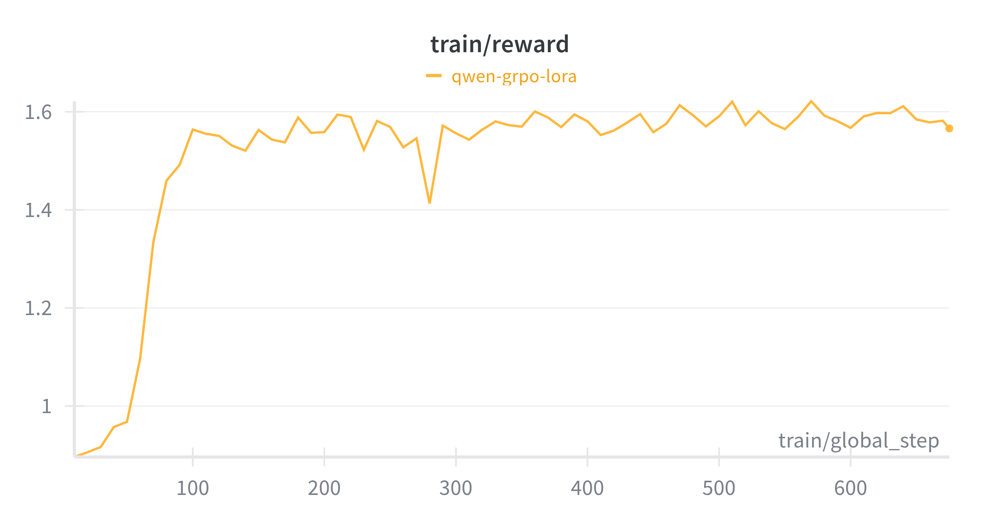

# Lesson 4: RL Fine-tuning with GRPO

*Welcome back to the AutoDoc course! In this lesson, we'll implement Group Relative Policy Optimization (GRPO) for docstring generation*

## 🎯 What You'll Learn

By the end of this lesson, you'll understand:
- How RL finetuning works for LLMs
- How to design effective reward functions for docstring quality
- How to configure GRPO training with the TRL library
- How to train GRPO using Modal infrastructure

## Background Recap

Reinforcement Learning (RL) is an LLM post-training technique that gained a lot of traction for [aligning LLMs with human preferences](https://arxiv.org/pdf/2203.02155) or improving LLMs [reasoning capabilities](https://arxiv.org/pdf/2305.20050).

Unlike SFT where the model learns from labeled data, the objective in RL finetuning is to *maximize a reward signal* that quantifies desirable behavior.

Formally, RL solves sequential decision-making problems by learning a policy $\pi(a|s)$ that governs how the RL agent behaves and takes actions. The LLM generation process can be modeled as a decision-making problem where the LLM decides, at each time step, the next token based on the previous ones. In this case, the language model itself is the policy $\pi(a|s)$ that decides which token to generate (action) based on the current context (state). Once the full response (or intermediate steps) are generated, a reward model $R(s, a)$ computes a scalar reward $r$ to assess the quality of the output. The reward model can be a learned model like in RLHF where a reward model is learned to rank responses based on human preferences. Alternatively, the reward model can be a rule-based evaluator, especially in cases where the exact answer is known (e.g., mathematics) or a heuristic like using another LLM to score the output of the language model.

The objective in RL is to maximize the expected returns
<div align="center">

$J(\pi) = \mathbb{E}_{a_t \sim \pi} [\sum_{t=0}^{\infty} \gamma^t R(s_t, a_t)]$

</div>

The return $\mathbb{E}_{a_t \sim \pi} [\sum_{t=0}^{\infty} \gamma^t R(s_t, a_t)]$ is called the infinite-horizon discounted return.

> If you are new to RL, [OpenAI Spinning Up](https://spinningup.openai.com/) offers a great and detailed introduction with code implementation.

For LLM finetuning, the objective above can be computed in different ways:
- *The reward computed at the end of the generation $R(x,y)$* where $x$ is the model's input (e.g., prompt) and $y$ is the language model's full response.
The objective becomes:
<div align="center">

$J(\pi) = \mathbb{E}_{y \sim \pi, x\sim D} [R(x,y)]$

</div>

- *Return computed over multiple reasoning steps* $\sum_{t=1}^{T} \gamma^t R(x_t, y_t)$ where $x_t$ is the concatenation of the initial input $x$ and the prior reasoning steps, $y_t$ is the next reasoning step, and $T$ is the length of the reasoning trace. The objective becomes:
<div align="center">

$J(\pi) = \mathbb{E}_{y_t \sim \pi(.|x_t), x_0\sim D} [\sum_{t=0}^{T} R(x_t,y_t)]$

</div>

To update the model (or policy) parameters, we compute the gradient of the objective above, which is called the **policy gradient** $\nabla J(\pi)$. Remember that the language model output $y$ is a sequence of tokens $(y_0, ..., y_T)$, hence the probability of generating the output $y$ is $\pi(y|x) = \prod_{t=0}^{t=T} \pi(y_t | x, y_{<t})$ and given that $\mathbb{E}[R(x,y)] = \sum_y \pi(y|x) R(x,y)$, the policy gradients are then given by
<div align="center">

$\nabla J(\pi) = \sum_y \nabla \pi(y|x) R(x,y) =  \sum_y  \pi(y|x) \nabla \log \pi(y|x) R(x,y) = \mathbb{E}[\nabla \log \pi(y|x) R(x,y)]$  (i.e., using [log-derivative trick](https://spinningup.openai.com/en/latest/spinningup/rl_intro3.html))

$\nabla J(\pi) = \mathbb{E}_{y\sim\pi}[(\sum_{t=0}^{T} \nabla \log \pi(y_t |x, y_{<t})) R(x,y)]$ (i.e., using the expression of $\pi(y|x)$ above).

</div>

For multi-step policy gradient, simply replace the terminal reward $R(x,y)$ by the expected return above.
Given the gradients above, the policy (or model) parameters $\theta$ can be updated using stochastic gradient ascent (remember we want to maximize $J$): $\theta_{t+1} = \theta_t + \alpha \nabla_\theta J(\pi_{\theta_t})$.
This is the fundamental of the **REINFORCE** algorithm. However, this method suffers from high variance due to reward variability and sequence length, which leads to noisy and fluctuating policy updates.

The alternative is to subtract a baseline that doesn't depend on the action from the reward, which yields the same gradients but with lower variance.
The *Actor-Critic* methods introduce the critic as the baseline, which is the value function $V(x)$ that evaluates the expected future returns at state $x$. The actor uses the policy gradients to update the policy where the *advantage function* $A(x,y)= Q(x,y) - V(x)$ determines how much better taking action $y$ in state $x$ is compared to the average expected return from that state. $Q(x,y)$ is the expected future return given a generation $y$ for the input $x$.

> Note that when we use the advantage function to measure how good an action is at a given state, the baseline is the Value function and the policy gradients become:
<div align="center">

$\nabla J(\pi) =  \mathbb{E}_{y\sim\pi}\Bigg[\Big(\sum_{t=0}^{T} \nabla \log \pi(y_t |x, y_{<t})\Big) A(x,y)\Bigg]$
</div>

The value function is also a trainable model $V_\phi$ learned by minimizing the squared error between the value estimates and the actual return.
<div align="center">

$\phi_{t+1} =  \argmin_\phi \mathbb{E}_{x_t \sim \pi_\theta}\Bigg[\Big(V_\phi(x_t) - R(x_t) \Big)^2 \Bigg]$
</div>

**Proximal Policy Optimization (PPO)** introduces a surrogate loss function that limits how much the policy can change at each update. The clip in the objective restricts how the updated policy distribution can diverge from the original policy. This improves training stability because it avoids huge shifts in the policy distribution (i.e., token distribution) which affects language generation.

<div align="center">

$L^{\text{CLIP}}(\pi) = \mathbb{E}_t \Bigg[
\min \Big(
\frac{\pi(y_t \mid x_t)}{\pi_{\text{old}}(y_t \mid x_t)} \, A_t, \;
\text{clip}\big(r_t(\theta), 1-\epsilon, 1+\epsilon \big) \, A_t
\Big)
\Bigg]$
</div>

> Note in RLHF, a KL penalty is added to the reward to prevent reward hacking.


**Group Relative Policy Optimization** simplifies the PPO algorithm by eliminating the value function. Instead, GRPO estimates the baseline as the average reward of multiple sampled outputs for the same prompt.

For each prompt $p$, GRPO samples a **group** of outputs $\{o_1, o_2, ..., o_G\}$ from the current policy $\pi_\theta$ (i.e., the LLM). A reward model is used to score each output in the group, yielding rewards $\{r_1, r_2, ..., r_G\}$. The group rewards are normalized by subtracting the group average and dividing by the standard deviation.


## Reward Function Design

The beauty of the GRPO algorithm is that it removes the need for human-annotated preferences to learn a reward model. The DeepSeek R1 model was trained using rule-based reward functions for accuracy and format. Similarly, for docstring generation, we will design reward functions that measure how good the generated documentation is.

### Semantic Quality Reward

The semantic quality reward uses three key metrics to evaluate the quality of the generated docstrings based on the target docstrings:

- **BERTScore F1**: Measures semantic similarity between generated and reference docstrings using contextualized embeddings. This captures meaning beyond exact word matches, understanding that "adds two numbers" and "sums two values" convey the same concept.

- **Token Overlap**: Calculates the proportion of tokens that appear in both the generated and reference docstrings. This provides a complementary measure to BERTScore by focusing on exact lexical matches, which are important for technical terminology.

- **Repetition Penalty**: Quantifies how repetitive the generated text is by measuring the ratio of unique tokens to total tokens. This prevents the model from generating redundant or repetitive docstrings that might score well on other metrics but are poor quality.

These metrics are combined with weights (0.6 for BERTScore, 0.3 for token overlap, and 0.1 for repetition penalty) to create a total semantic reward that balances semantic accuracy, lexical precision, and text quality.

```python
def semantic_reward(completions: list[str], docstring: list[str], **kwargs) -> list[float]:
    """Calculate semantic reward combining BERTScore, token overlap, and repetition penalty."""
    clean_refs = [clean_text(r) for r in docstring]
    clean_preds = [clean_text(c) for c in completions]

    # Calculate BERTScore for semantic similarity
    _, _, F1 = score(
        clean_preds,
        clean_refs,
        lang="en",
        verbose=False,
        device="cuda" if torch.cuda.is_available() else "cpu",
    )
    F1 = F1.tolist()

    rewards = []
    for i in range(len(clean_preds)):
        r_semantic = float(F1[i])  # BERTScore F1
        r_overlap = float(token_overlap(clean_preds[i], clean_refs[i]))  # Token overlap
        r_repetition = float(repetition_penalty(clean_preds[i]))  # Repetition penalty

        # Combined reward: semantic similarity + token overlap - repetition penalty
        r_total = 0.6 * r_semantic + 0.3 * r_overlap - 0.1 * r_repetition
        r_total = max(0.0, min(1.0, r_total))  # Clamp to [0, 1]
        rewards.append(r_total)

    return rewards
```

### Length Quality Reward

Ensures docstrings are neither too short nor too long function below computes a penalty if the generated docstring is short or longer than an optimal range.

```python
def length_penalty(docstring: str, optimal_range: tuple[int, int] = (50, 500)) -> float:
    """Penalize docstrings that are too short or too long."""
    if not docstring:
        return 0.0

    length = len(docstring.strip())
    min_len, max_len = optimal_range

    if length < min_len:
        return length / min_len
    elif length > max_len:
        return max(1.0 - (length - max_len) / max_len, 0.3)
    else:
        return 1.0
```

It is possible to add more reward functions to ensure the docstrings follow specific formats. Feel free to implement new reward functions and submit a PR! 😊 The full implementation of the reward functions is in [rewards.py](../autoDoc/rewards.py).

> The reward functions above are normalized (output is scalar between 0 and 1).

## GRPO Implementation

The data preparation pipeline is detailed in [lesson 2](./lesson-2-data-preparation.md). As a reminder, the input prompt is formatted using the template below. We also use the real docstrings as reference to compute the rewards.

```python
GRPO_PROMPT = """You are an expert software engineer who writes clear, comprehensive docstrings for code functions.

Task: Generate a docstring for the following {language} function.

Code:
{code}

Docstring:"""
```

### GRPO Trainer Setup

We will use the `GRPOTrainer` from the TRL library. The GRPO trainer is configured in a similar way to the SFT trainer except for the GRPO-specific parameters. It is important to note that we don't fine-tune the whole model with RL. We will use LoRA and only LoRA adapters are fine-tuned using GRPO.

```python

from trl import GRPOTrainer, GRPOConfig

training_args = GRPOConfig(
    num_train_epochs=config.num_train_epochs,
    seed=config.seed,
    learning_rate=config.learning_rate,
    lr_scheduler_type=config.lr_scheduler_type,
    warmup_steps=config.warmup_steps,
    logging_steps=config.logging_steps,
    per_device_train_batch_size=config.batch_size,
    gradient_accumulation_steps=config.gradient_accumulation_steps,

    # GRPO-specific parameters
    num_generations=config.num_generations,
    max_completion_length=config.max_completion_length,
    temperature=config.temperature,
    top_p=config.top_p,
    top_k=config.top_k,
    use_vllm=config.use_vllm,

    # Standard training parameters
    save_steps=config.save_steps,
    report_to=config.report_to,
    output_dir=checkpoint_path,
    eval_steps=config.eval_steps,
    eval_strategy="steps" if not config.skip_eval else "no",
    save_strategy="steps",
    bf16=config.bf16,
)

return GRPOTrainer(
    model=model,
    processing_class=tokenizer,
    reward_funcs=[semantic_reward, length_reward],  # Multiple reward functions
    args=training_args,
    train_dataset=train_dataset,
    eval_dataset=eval_dataset,
)
```
We provide the list of reward functions to the GRPOTrainer. It is possible to specify reward weights to compute the final reward. If no weights are specified, the rewards are simply summed.

## Training Infrastructure

The Modal infrastructure setup is identical to SFT, but with GRPO-specific configuration:

### Running GRPO Training
The training infrastructure is the same as the SFT training. To run the GRPO training:

```bash
# Basic GRPO training
modal run -i -m autoDoc.train \
    --training-type grpo \
    --experiment-name "codegemma-grpo-v1" \
    --model-name "google/codegemma-2b" \
    --num-train-epochs 1 \
    --batch-size 2 \
    --learning-rate 1e-5 \
    --num-generations 4 \
    --temperature 0.7
```

## Experiments and Results

> **Cost Note**: GRPO training is more expensive than SFT due to multiple generations per prompt. Expect 2-3x higher costs for similar dataset sizes.

For these experiments, I used the `Qwen-2.5Coder-1.5B` as the base model because I faced issues with `CodeGemma` that might be related to this [bug](https://github.com/huggingface/trl/issues/3520).


<div align="center">
<table>
<tr>
<td align="center">
<b>Total reward</b><br/>

</td>
<td align="center">
<b>Semantic reward</b><br/>

</td>
<td align="center">
<b>Length reward</b><br/>

</td>
</tr>
</table>
</div>

It is clear that the model is improving on the length reward faster than the semantic reward. Hence, the importance of balancing the reward functions. It might be beneficial here to put more weight on the semantic reward to incentivize the model to focus on the semantic reward.

> The model is trained for 600 timesteps, which is 2x the number of SFT training steps since I use 2 generations per prompt.

---

## 🚀 What's Next?

Congratulations! You've successfully implemented RL fine-tuning using GRPO. In the next lesson, we'll explore:

- **Lesson 5**: Comprehensive evaluation and model comparison

*Ready to dive deeper? You can explore the full implementation in the [AutoDoc repository](https://github.com/fastbatchai/docstring-generation)*
