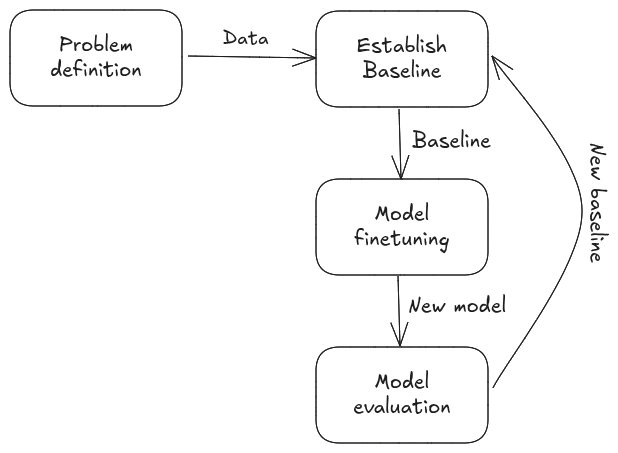

# Lesson 5: Model Evaluation and Metrics

*Welcome back to the AutoDoc course! In this final lesson, we'll explore comprehensive evaluation strategies for fine-tuned LLMs, focusing on different metrics to assess docstring generation quality.*

## 🎯 What You'll Learn

By the end of this lesson, you'll understand:
- How to evaluate fine-tuned LLMs comprehensively
- Different evaluation metrics and their trade-offs
- How to use BERTScore, perplexity, and LLM-as-judge for evaluation
- How to interpret evaluation results and identify model strengths/weaknesses

## Background Recap

Evaluation is crucial for understanding how well your finetuned model performs. Unlike classification tasks with clear accuracy metrics, text generation requires multiple evaluation dimensions to assess quality comprehensively. I will briefly cover different evaluation approaches. There is a plethora of resources on LLM evaluation online (e.g., [here](https://magazine.sebastianraschka.com/p/llm-evaluation-4-approaches), [here](https://www.confident-ai.com/blog/llm-evaluation-metrics-everything-you-need-for-llm-evaluation#different-ways-to-compute-metric-scores)). In this section, I'm summarizing my experience evaluating LLMs' performance.

One of the biggest challenges in evaluating LLMs is the availability of **evaluation data**. For docstring generation, it is easy to secure enough evaluation data since a public dataset exists. However, in real-world projects, this is seldom the case. Most real-world projects in industry are usually company-specific and it is rare that you find well-structured datasets unless in big companies or research labs. In this case, there are three options: (1) Manually curating an evaluation dataset, (2) generating a synthetic evaluation dataset, or (3) adopting a semi-supervised approach where synthetic examples are validated by human annotators.

In my experience, option 3 is the best approach when labeled data is not available. It is obvious that option 1 is best to generate high-quality evaluation data, especially when the task requires expert knowledge. However, manual data curation is expensive and time-consuming. Option 3 helps speed up the process by generating examples and relying on human experts to validate them. This process is still time-consuming and can be expensive, but it is considerably less compared to option 1. Option 2 is the last resort where using human experts is not possible (for cost or availability reasons). Synthetic data generation is becoming more common, especially with the rise of LLMs. However, generating high-quality diverse evaluation datasets is not easy for two main reasons: (1) how can we create realistic samples, and (2) how can we automatically verify the correctness of the generated data?

I have worked on a text-to-GraphQL generator and constructing the evaluation dataset was one of the main challenges in the project. When I used a powerful LLM (e.g., ChatGPT-4o) to generate question and query pairs, I noticed several issues that made human validation a must. The challenges I faced are:
- **Correctness**: The generated queries are either syntactically wrong or provide the wrong response.
- **Optimization**: LLMs tend to generate long, unoptimized queries that take a long time to execute.
- **User-like questions**: Usually the generated questions are simplistic (e.g., ask a question about a specific node or attribute), which is far from real-world user questions.

There is a lot of [research](https://arxiv.org/pdf/2502.14678) to improve the quality of synthetically generated data for evaluation, but I didn't get the chance to try them for a real-world project.

You might be asking: why do we need labeled data in the first place? Aren't LLMs supposed to be unsupervised?
Labeled data is needed because there simply aren't a lot of **unbiased** evaluation metrics you can compute without true labels. I will touch on this later when I discuss LLMs-as-a-judge.

Here is where an evaluation dataset is needed:
- Model selection
- Prompt Optimization
- Model performance monitoring

## Evaluation Framework

### Problem Definition

Before starting finetuning, it is essential to define the metrics used to evaluate the model's performance. These metrics will be communicated with other teams to assess the readiness of the model for deployment. For our case, we are interested in different performance metrics:
1. **Correctness**: Whether the documentation accurately describes the code
2. **Fluency and coherence**: Whether the text reads naturally
3. **Alignment**: Whether the generated text is aligned with human preferences

Later we will discuss how we will be computing these metrics.

### Establish a Baseline

Like any ML project, LLM fine-tuning is an iterative process where the model is progressively improved to meet the project expectations. As illustrated above, assuming that the data is available, the fine-tuning process **should** start with *establishing a baseline*. This step usually includes a model selection step where first different off-the-shelf models are benchmarked to establish the best performing model that will be considered as a baseline. A baseline provides a performance lower bound that the fine-tuning is expected to improve.

For this project, I selected **CodeGemma** as the baseline based on [previous work](https://arxiv.org/pdf/2405.10243).

### Evaluation

To evaluate the model on the metrics above, we need to define how to measure these metrics. There are two main ways to compute the evaluation metrics: (1) **reference-based** where generated outputs are compared to expected answers, and (2) **reference-free** where the generated outputs are assessed *without* ground truth. To learn more about LLM evaluation metrics, please check these examples ([example 1](https://learn.microsoft.com/en-us/ai/playbook/technology-guidance/generative-ai/working-with-llms/evaluation/list-of-eval-metrics), [example 2](https://www.evidentlyai.com/blog/llm-evaluation-framework)).

#### Reference-Based Evaluation Metrics

These metrics compare the generated text to a reference. This is where an annotated evaluation dataset is needed. For this project, I implemented the following metrics:
- **Semantic similarity** using **BERTScore** to compute the similarity between the generated output and the reference docstring
- **Pairwise Comparison** using an LLM-as-a-judge to compare the generated output and the reference.

#### Reference-Free Evaluation Metrics

In this category, no ground truths are needed. These metrics help assess the quality of the generated outputs on different dimensions like toxicity, safety, etc.
- **Perplexity** is commonly used in pre-training. It is not recommended to use with SFT or post-training because it doesn't help assess the ability of the model to follow instructions. However, it can be used to assess the fluency of the generated text and how uncertain the model is when seeing the reference docstring.
- **LLM-as-a-judge** uses an LLM to score the responses along different dimensions like completeness, tonality, etc.

LLM-as-a-judge is becoming common to evaluate LLM applications, especially when ground truth data is lacking. However, this evaluation method doesn't provide an unbiased evaluation since it depends on the used LLM and how it is instructed. It can be used as part of development, but for production monitoring, I believe reference-based metrics are needed.

You can check the full implementation in [evaluate_model](../autoDoc/evaluate_model.py). Note that the `HfPairwiseJudge` from TRL uses a HuggingFace inference endpoint which is limited for free users. You might want to switch to `OpenAIPairwiseJudge`, but that will result in more costs.

## Final Results

> All results are computed using 500 samples (100 samples for each programming language).

### Semantic Similarity Comparison: CodeGemma vs CodeGemma+LoRA

| Language | CodeGemma | CodeGemma+LoRA | Improvement |
|:--------:|:---------------------:|:--------------:|:-----------:|
| Python   | 0.47                 | 0.52           | **+11%**        |
| Java     | 0.57                 | 0.55           | -4%         |
| JavaScript | 0.43                 | 0.48           | **+12%**        |
| Go       | 0.49                 | 0.54           | **+10%**        |
| PHP      | 0.42                 | 0.63           | **+50%**        |
| Ruby     | 0.52                 | 0.60           | **+15%**        |

The table above compares the performance of CodeGemma before and after SFT. For almost all programming languages, there is a decent improvement in the semantic similarity of the generated docstrings after fine-tuning. There is a slight deterioration for Java. It is interesting to see here the different performance for the different tasks (programming languages). With more training time and samples, these numbers might improve further.

> Unfortunately, I don't have the results from the LLM-as-a-judge evaluation since I exceeded the free credits offered by HF inference endpoints. I'm working on another way where I can use an LLM-as-a-judge for free.

*Ready to put your knowledge to practice? You can explore the full implementation in the [AutoDoc repository](https://github.com/fastbatchai/docstring-generation)*
